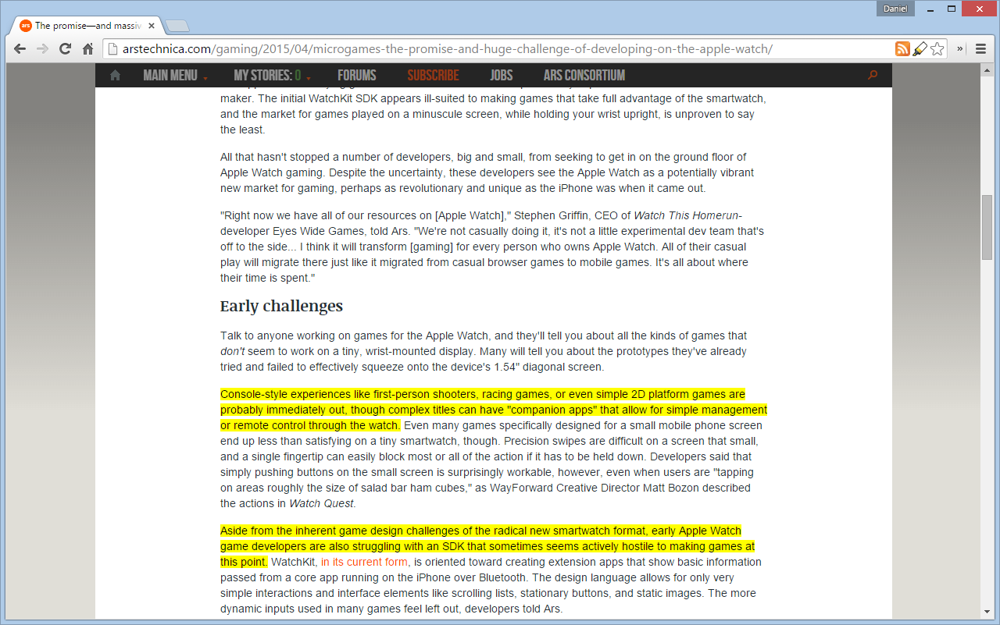

Auto Highlight
==============

Keywords: tldr, tl;dr, article, summarizer, summarization, summary, highlight, highlighting, highlighter

*Auto Highlight* is a browser extension that automatically highlights the important
content on article pages.

The extension is available from various browser add-on repositories.

* Chrome
    - https://chrome.google.com/webstore/detail/highlight/dnkdpcbijfnmekbkchfjapfneigjomhh
* Firefox
    - https://addons.mozilla.org/firefox/addon/auto-highlight/
* Edge
    - https://microsoftedge.microsoft.com/addons/detail/djobhcecijhljcmdohlobhgiconbhnoo

To use *Auto Highlight*, install the extension, and click the highlighter
icon in the location bar. Clicking multiple times changes the
highlighting coverage.

Screenshot
----------

The following image shows the highlighting on an article after clicking the
*Auto Highlight* icon once.

Development
-----------

A different `manifest.json` is used for Chrome and Firefox. For development, create a symbolic link
`manifest.json` that points to either `manifest_chrome.json` or `manifest_firefox.json`, depending
on the environment.

To generate zip archives, run `zip.sh`.

Privacy Policy
--------------

The *Auto Highlight* browser extension does not collect user data nor transmit user data remotely. Options
for the extension are saved locally.

License
-------

See [LICENSE](LICENSE).
This license does not apply to the libraries. For the library licenses, see the corresponding license files
in [src/lib](src/lib).

Acknowledgments
---------------

*Auto Highlight* contains code from:

1. [readabilitySAX](https://github.com/fb55/readabilitySAX)
  * Modifications (see [other/readabilitySAX.js.diff](other/readabilitySAX.js.diff))
    1. Add getNodes() for returning nodes
    2. Incorporate readabilitySAX/browsers/DOMasSAX.js
2. [Porter-Stemmer](https://github.com/kristopolous/Porter-Stemmer)
